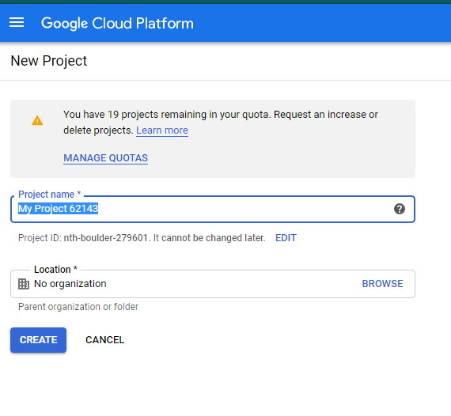
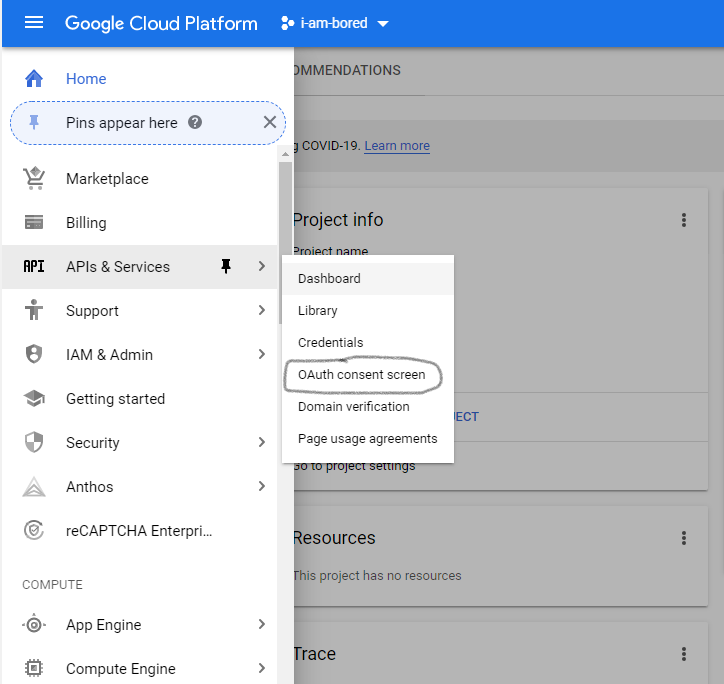
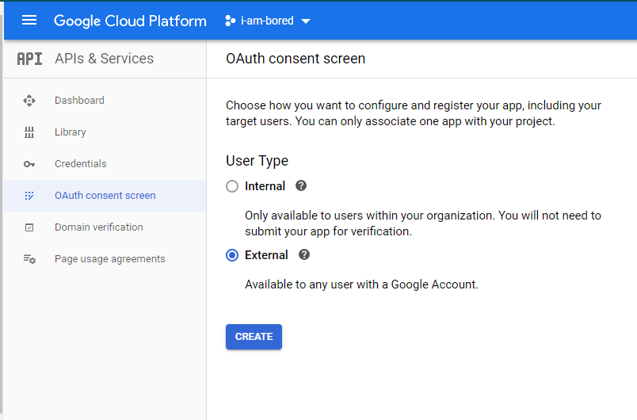
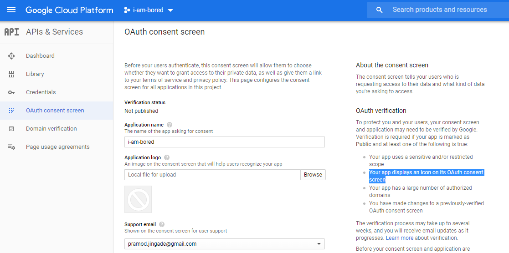
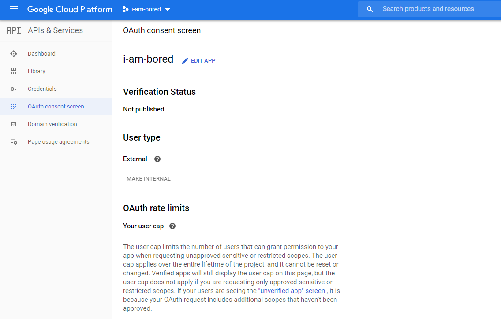
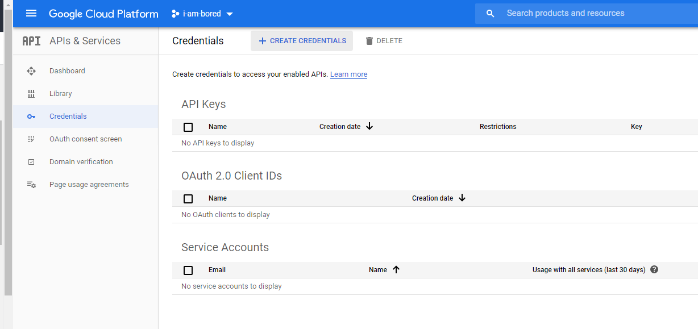
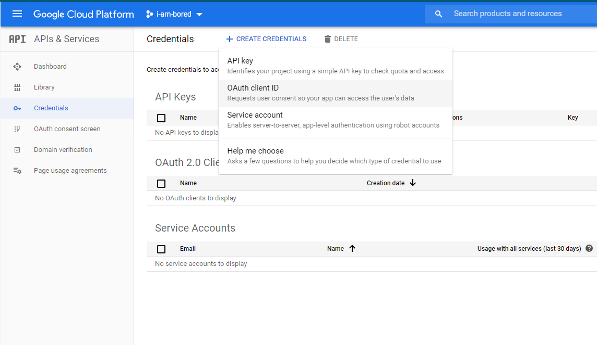
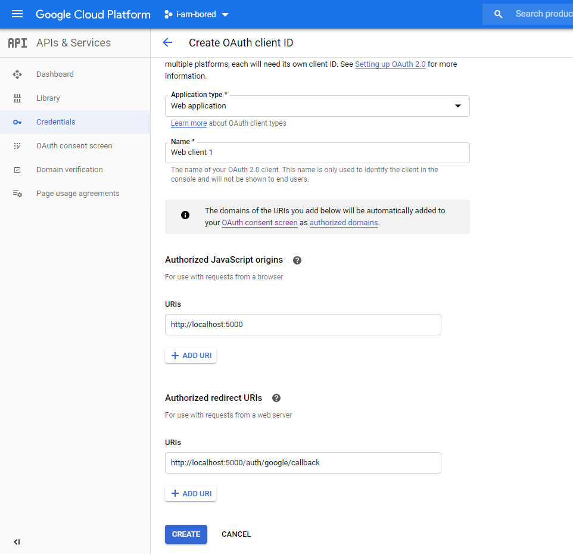
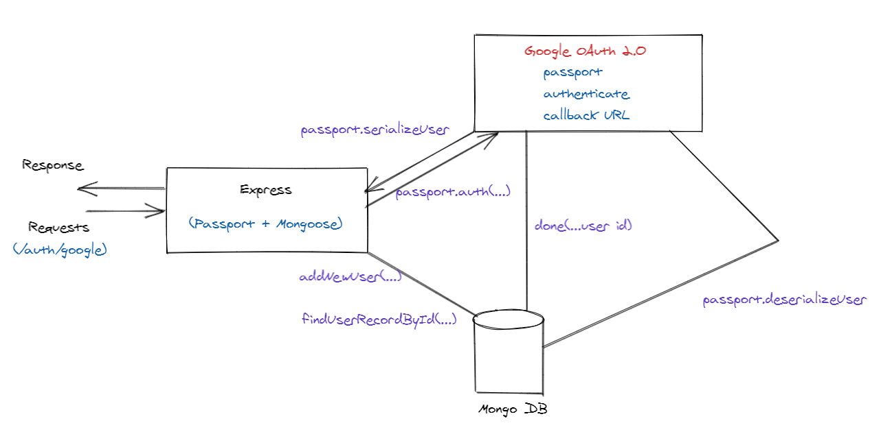

# 🤖 Google OAuth 2.0 using Node Express Mongo 🍀 React ⚛

## Github Repo

- [OAuth - I.AM.B.O.R.E.D Kitchen App](https://github.com/avj2352/i-am-bored)

The following document takes a step by step approach for creating and setting up Authentication Flow using social Login (Google) + Express + MongoDB + React.

## 1. Database Setup

You can setup either localhost / cloud DB. I setup a cloud database in my case

```bash
mongodb://<dbuser>:<dbpassword>@ds123695.mlab.com:23695/i-am-bored-db
```

> NOTE: In case you need to connect using a client - Compass. Remember that the authentication database field is `i-am-bored-db`

---

## 2. Heroku Details

- [Heroku Link](https://iamboard.herokuapp.com/)

```bash
# Clone Heroku repo
$ heroku git:remote -a iamboard
```

---

## 3. Google Cloud Manager Account

- [Google Console Developer -OAuth Registration](https://console.cloud.google.com/)

Head over this website and follow the instructions carefully.



- Enter the name of the project (in this case: `i-am-bored`)
- Google take a couple of mins to setup the project

---

## 2 Things to start using Google OAuth

- Enable the OAuth Services for **i-am-bored** project
- Generate OAuth 2.0 client ID and client Secret

We need to do these two things to enable Google to talk to our server




- Now under the new project `i-am-bored`, Navigate to the sidebar
- Choose **Sidebar** 👉 **APIs & Services**  👉 **OAuth consent screen**



- In the OAuth consent screen 👉 Select The User Type radio button option to **External**
- Click **Create** button



> - **NOTE**: In the above screen, Provide only the **Application name**
> - **NOTE:** Don't be an asshole and upload your application icon. Because Google will need time to verify your account if you upload even a PICTURE!

- Click **Save** Button



- This is how your application should look like
- Navigate to 👉 **Credentials** 👉 **Create Credentials**



- Enter the details as shown below





- You will then obtain a **Client ID** & **Client Secret** that you need to store in your application

- Select Web Application and fill out the **"Authorized JavaScript Origins"** and **"Authorized redirect URI"** and click the **"Create"** button.

- Authorized JavaScript Origins: **http://localhost:5000**

- Authorized redirect URI: **http://localhost:5000/auth/google/callback**

>  **Note!** Google has made a number of changes to the OAuth credential's restrictions, and no longer allows wildcards in the redirect URI field. If you follow along with the upcoming video lecture you will get this error: ***Invalid Redirect: cannot contain a wildcard (\*)\***

>  Since the main goal of using *http://localhost:5000/** was to show the redirect error a few lectures later, we entered the correct redirect as shown above since this is what it will be changed to anyway.

---

## Copy Client ID and Secret

- Client ID

```bash
1014313043742-3o8tjkq730kkcuc0gum4efbjs8fbdkpi.apps.googleusercontent.com
```

- Client Secret

```bash
iHuNFNJT-i73D9KuWMEvtQeI
```

---

# NodeJS + Mongoose  = OAuth Flow



Actually for my current implementation to work, the following Tech Stack is required at backend.

> **NOTE:** *Currently, Mongo DB + Mongoose + Express is a tightly coupled logic, required for OAuth flow. ie., without a DB, The OAuth flow cannot be achieved.* 

Some of the most required libraries for the authentication module are:

- **config**: Environment configuration library. Must requirement for cloud deployment `"config": "^3.2.3"`
- **cookie-session**: The current authentication flow makes use of cookies to be sent as part of the Header request, so activating session using cookies for node js : `"cookie-session": "^1.4.0"`
- **mongoose**: Mongo DB driver library for Node JS. This is required for defining the user model which plays a crucial role to store OAuth details in backend `"mongoose": "^5.6.2"`
- **passport**: OAuth library for Node JS `"passport": "^0.4.0"`
- **passport-google-oauth20**: Google strategy library for Node JS `"passport-google-oauth20": "^2.0.0"`

## Backend Libraries

The following is the Backend Module registration

> `package.json`

```json
{
  "name": "i-am-board-api",
  "version": "1.0.0",
  "description": "rest api for bored recipe app",
  "main": "index.js",
  "author": "pramod",
  "license": "MIT",
  "engines": {
    "node": "12.15.0",
    "npm": "6.13.4"
  },
  "scripts": {
    "start": "node ./dist/index.js",
    "build": "npm run build-babel",
    "start:dev": "nodemon ./src/index.js --exec babel-node -e js",
    "build-babel": "babel -d ./dist ./src -s",
    "clean": "del src/build && mkdir build"
  },
  "keywords": [
    "recipe",
    "pwa",
    "express",
    "mongoose",
    "pramod",
    "kitchen"
  ],
  "dependencies": {
    "bookshelf": "0.9.2",
    "colors": "^1.4.0",
    "config": "^3.2.3",
    "cookie-session": "^1.4.0",
    "express": "^4.17.1",
    "mongoose": "^5.6.2",
    "passport": "^0.4.0",
    "passport-google-oauth20": "^2.0.0",
    "showdown": "^1.9.0",
    "uuid": "^3.3.3"
  },
  "devDependencies": {
    "babel-cli": "^6.26.0",
    "babel-loader": "^8.1.0",
    "babel-plugin-transform-runtime": "^6.23.0",
    "babel-polyfill": "^6.26.0",
    "babel-preset-es2015": "^6.24.1",
    "babel-preset-stage-0": "^6.24.1",
    "babel-runtime": "^6.26.0",
    "nodemon": "^1.19.1",
    "prettier": "^1.18.2"
  }
}

```


## Enable Async / Await on Express

For the Authentication, I am making use of a lot of `synchronous` code execution using the `async / await` keywords. For them to work on a Node JS + Express project. For those keywords to work, you need  configuration file - `.babelrc`

> `.babelrc`

```json
{
    "presets": [
        "es2015",
        "stage-0"
    ],
    "plugins": [
        ["transform-runtime", {
          "regenerator": true
        }]
    ]
}
```

---

# Heroku Deployment Setup

With Heroku, it's simple - you define the environment variables by refering to the `config.util.js` present in the **src** 👉**util** 👉 **config.util.js**

## Fixing Heroku proxy issue

When it comes to Heroku, Heroku does not have a redirect automatically built in between **http** and **https**. It needs to be enabled by setting the **proxy** flag to true in your server side configuration

*But how would Google know to switch on Heroku's proxy ?*

## Two ways to remedy this problem

1. While configuring the redirect URLs in Google, instead of the relative URL redirect for call back. hard code the actual full lenght URL of where you want to deploy to Heroku

```bash
# Authorized Redirect URIs
URI: https://i-am-bored.herokuapp.com/auth/google/callback
```

2. You turn on **proxy** configuration in passport JS which informs Google which then informs Heroku to switch http redirects to https

```javascript
passport.use(new GoogleStrategy({
            clientID: getGoogleClientId(),
            clientSecret: getGoogleClientSecret(),
            callbackURL: getGoogleOAuthRedirect(),
            proxy: true // Enabling PROXY in Heroku, to inform Heroku to redirect from http to https
        }, async (accessToken, refreshToken, profile, done) => {
            const result = await this.authService.findUserRecordByGoogleId(profile.id);
            if(!result) {
                const record = await this.authService.addNewUser(profile);
                existingUser = record;
                console.log(`New User - Add Record`.info, existingUser);
                await done(null, existingUser);
            } else {
                existingUser = result;
                console.log(`User record already exists`.info, existingUser);
                await done(null, existingUser);
            }
        }));
```

---

