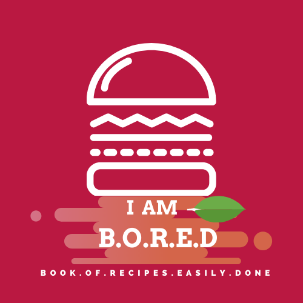

# I AM B.O.R.E.D



A Progressive Web application to Read, Create, Share cooking recipes. The Full name of the application stands for: `I am Book Of Recipes Easily Done`.

## App Names

- **I am B.O.R.E.D** : I am Book Of Recipes Easily Done
- **G.I.R.A** : Great Indian Recipe Application
- **Y.M.C.A** : Yo! My Cooking App / Your Mobile Cooking App
- **C.R.Y** : Cookbook Recipe, Yeah !!

---

## ETA of Project Completion

Comparing a Similar project I pulled off in the past. The Total time taken to complete this application would be:


---

## Date Modelling


## Tech Stack

- Node JS + Express (possibly Typescript)
- GraphQL + Apollo
- React + Typescript
- Mongo DB (Compass / MLab)
- OAuth 2.0 (Google) / Firebase Authentication

---

## Important Links

- [Kanbanchi - Tasks / Backlog Link](https://kanban-chi.appspot.com/dashboard/5515963025588224-6179838427398144/d-5515963025588224)
- [PWA assets generator - IOS](https://github.com/onderceylan/pwa-asset-generator)
- [Material UI Theme Generator](https://cimdalli.github.io/mui-theme-generator/)
- [NEW* - Material UI Theme Generator](https://github.com/in-your-saas/material-ui-theme-editor)

## Heroku Details

- [Heroku Link](https://iamboard.herokuapp.com/)

```bash
# Clone Heroku repo
$ heroku git:remote -a iamboard
```


## Adobe Color Wheel

```css
/* Color Theme Swatches in Hex */
.color-theme_abstract-painting-1252848-1-hex { color: #2E2473; }
.color-theme_abstract-painting-1252848-2-hex { color: #0B7ABF; }
.color-theme_abstract-painting-1252848-3-hex { color: #F29F05; }
.color-theme_abstract-painting-1252848-4-hex { color: #F2762E; }
.color-theme_abstract-painting-1252848-5-hex { color: #F25244; }

/* Color Theme Swatches in RGBA */
.color-theme_abstract-painting-1252848-1-rgba { color: rgba(46, 36, 115, 1); }
.color-theme_abstract-painting-1252848-2-rgba { color: rgba(11, 122, 191, 1); }
.color-theme_abstract-painting-1252848-3-rgba { color: rgba(242, 159, 5, 1); }
.color-theme_abstract-painting-1252848-4-rgba { color: rgba(242, 118, 46, 1); }
.color-theme_abstract-painting-1252848-5-rgba { color: rgba(242, 82, 68, 1); }

/* Color Theme Swatches in Hex */
.color-theme_IMG_20181015_234550-1-hex { color: #F21B42; }
.color-theme_IMG_20181015_234550-2-hex { color: #BF1B39; }
.color-theme_IMG_20181015_234550-3-hex { color: #A61C41; }
.color-theme_IMG_20181015_234550-4-hex { color: #73224F; }
.color-theme_IMG_20181015_234550-5-hex { color: #1B2A59; }

/* Color Theme Swatches in RGBA */
.color-theme_IMG_20181015_234550-1-rgba { color: rgba(242, 27, 66, 1); }
.color-theme_IMG_20181015_234550-2-rgba { color: rgba(191, 27, 57, 1); }
.color-theme_IMG_20181015_234550-3-rgba { color: rgba(166, 28, 65, 1); }
.color-theme_IMG_20181015_234550-4-rgba { color: rgba(115, 34, 79, 1); }
.color-theme_IMG_20181015_234550-5-rgba { color: rgba(27, 42, 89, 1); }
```

---

# IOS

## Icons for IOS

Generated using PWA Asset Generator

Below is the icons content for your manifest.json file. You can copy/paste it manually

```json
[
  {
    "src": "ios/manifest-icon-192.png",
    "sizes": "192x192",
    "type": "image/png"
  },
  {
    "src": "ios/manifest-icon-512.png",
    "sizes": "512x512",
    "type": "image/png"
  }
]
```

## Splash Screen on IOS

Include the following code in your `index.html` page


# DB value (to be deleted)

```bash
mongodb://<dbuser>:<dbpassword>@ds123695.mlab.com:23695/i-am-bored-db
```