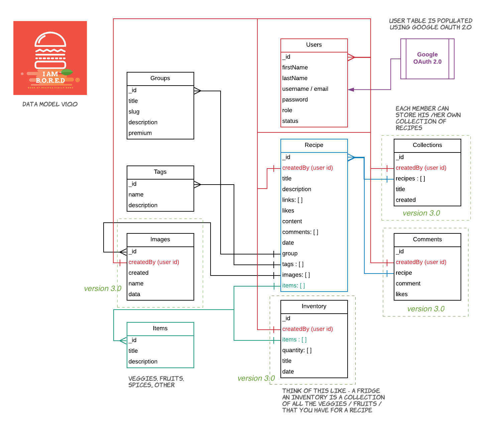

# I AM B.O.R.E.D

A Progressive Web application to Read, Create, Share cooking recipes. The Full name of the application stands for: `I am Book Of Recipes Easily Done`.

## Date Modelling



### Models

The following are the defined / possible Models in B.O.R.E.D DB -
- **User** : For Authentication - Google OAuth 2.0
- **Groups** : Creating Group, Filter recipes, Sidebar
- **Tags** : Adding Tags to Recipes
- **Items**: Important Items that a Recipe is composed of
- **Images**: Any Images that are uploaded to the application
- **Inventory**: Most important*. A manifest of Items that are in a User's possession / archive - ie., Fridge, Kitchen
- **Recipe**: An Article on how to prepare a dish. Type Private / Public
- **Collections**: Make a playlist of group of recipes for an occasion

## App Names

- **I am B.O.R.E.D** : I am Book Of Recipes Easily Done
- **G.I.R.A** : Great Indian Recipe Application
- **Y.M.C.A** : Yo! My Cooking App / Your Mobile Cooking App
- **C.R.Y** : Cookbook Recipe, Yeah !!

---

## ETA of Project Completion

Comparing a Similar project I pulled off in the past. The Total time taken to complete this application would be:
- [Days Left to Complete Application](https://timely-travel.herokuapp.com/#/preview/5eae03b085b06800176ebd7d)

---

## Tech Stack

- Node JS + Express (possibly Typescript)
- ~~GraphQL + Apollo~~
- React + Typescript
- Cookie Session
- Mongo DB (Compass / MLab)
- OAuth 2.0 (Google) / ~~Firebase Authentication~~

---

## Integratable Editors I tried during this app

### Rich Markdown Editor

Provides a very simple Interface. Perfect for writing editors that are built from scratch.

- Requires a peer dependency of Styled Components
- [Rich Markdown Editor - npm](https://www.npmjs.com/package/rich-markdown-editor)

### Package.json
```json
{
  "rich-markdown-editor": "^11.0.11",
  "styled-components": "^5.2.1"
}
```

### Usage

```js
import Editor from "rich-markdown-editor";
...
...
...
<Editor
    placeholder="Enter Item Description"
    defaultValue="Hello world!"/>
```

---

### CKEditor 5 (Build)

Also great for integrating with HTML, Minimal Coding required. Comes with a Build version which
is easy to integrate into React

```json
{
  "@ckeditor/ckeditor5-build-classic": "^24.0.0",
  "@ckeditor/ckeditor5-editor-classic": "^24.0.0",
  "@ckeditor/ckeditor5-essentials": "^24.0.0",
  "@ckeditor/ckeditor5-markdown-gfm": "^24.0.0",
  "@ckeditor/ckeditor5-react": "^3.0.0",
}
```

Also you need to declare these in `src/types.d.ts`

```js
declare module '@ckeditor/ckeditor5-react';
declare module '@ckeditor/ckeditor5-build-classic';
```

---

### CKEditor 4

More feature oriented than the simplistic CK Editor 5. also comes with an image plugin

- [CK Editor 4 - React](https://ckeditor.com/docs/ckeditor4/latest/examples/react.html#/)
- [CK Editor 4 - Installation](https://ckeditor.com/docs/ckeditor4/latest/guide/dev_react.html)

```json
"ckeditor4-react": "^1.3.0",
```


## Important Links

- [Collection of UI Designs - XD, Wireframes](https://uidesigndaily.com/posts/sketch-file-upload-form-day-919)
- [Release Countdown Timer](https://timely-travel.herokuapp.com/#/preview/5ed21485c51b01001783b512) 
- [Kanbanchi - Tasks / Backlog Link](https://kanban-chi.appspot.com/dashboard/5515963025588224-6179838427398144/d-5515963025588224)
- [PWA assets generator - IOS](https://github.com/onderceylan/pwa-asset-generator)
- [Tailwind CSS](https://tailwindcss.com/)
- [Tailwind - Components](https://tailwindcomponents.com/component/product-preview)
- [SVG Loaders](https://codepen.io/nikhil8krishnan/pen/rVoXJa)
- [Tailwind Components - Tooltip](https://tailwindcomponents.com/component/tooltip)
- [Mongoose - Full Text & Partial Text Search](https://www.youtube.com/watch?v=ZC2aRON3fWw)
- [JSON Tree Path Query](https://jsonpath.com/)
- [XML Tree Path Query](http://xpather.com/)


## Heroku Details

- [Heroku Link](https://iamboard.herokuapp.com/)

```bash
# Clone Heroku repo
$ heroku git:remote -a iamboard
```

## UI Wireframes
- []


## Adobe Color Wheel

```css
/* Color Theme Swatches in Hex */
.color-theme_abstract-painting-1252848-1-hex { color: #2E2473; }
.color-theme_abstract-painting-1252848-2-hex { color: #0B7ABF; }
.color-theme_abstract-painting-1252848-3-hex { color: #F29F05; }
.color-theme_abstract-painting-1252848-4-hex { color: #F2762E; }
.color-theme_abstract-painting-1252848-5-hex { color: #F25244; }

/* Color Theme Swatches in RGBA */
.color-theme_abstract-painting-1252848-1-rgba { color: rgba(46, 36, 115, 1); }
.color-theme_abstract-painting-1252848-2-rgba { color: rgba(11, 122, 191, 1); }
.color-theme_abstract-painting-1252848-3-rgba { color: rgba(242, 159, 5, 1); }
.color-theme_abstract-painting-1252848-4-rgba { color: rgba(242, 118, 46, 1); }
.color-theme_abstract-painting-1252848-5-rgba { color: rgba(242, 82, 68, 1); }

/* Color Theme Swatches in Hex */
.color-theme_IMG_20181015_234550-1-hex { color: #F21B42; }
.color-theme_IMG_20181015_234550-2-hex { color: #BF1B39; }
.color-theme_IMG_20181015_234550-3-hex { color: #A61C41; }
.color-theme_IMG_20181015_234550-4-hex { color: #73224F; }
.color-theme_IMG_20181015_234550-5-hex { color: #1B2A59; }

/* Color Theme Swatches in RGBA */
.color-theme_IMG_20181015_234550-1-rgba { color: rgba(242, 27, 66, 1); }
.color-theme_IMG_20181015_234550-2-rgba { color: rgba(191, 27, 57, 1); }
.color-theme_IMG_20181015_234550-3-rgba { color: rgba(166, 28, 65, 1); }
.color-theme_IMG_20181015_234550-4-rgba { color: rgba(115, 34, 79, 1); }
.color-theme_IMG_20181015_234550-5-rgba { color: rgba(27, 42, 89, 1); }
```

---

# IOS

## Icons for IOS

Generated using PWA Asset Generator

Below is the icons content for your manifest.json file. You can copy/paste it manually

```json
[
  {
    "src": "ios/manifest-icon-192.png",
    "sizes": "192x192",
    "type": "image/png"
  },
  {
    "src": "ios/manifest-icon-512.png",
    "sizes": "512x512",
    "type": "image/png"
  }
]
```

## Splash Screen on IOS

Include the following code in your `index.html` page

---

## Build Scripts

Because its a simple Node JS Express project, The following scripts serve most useful when
cleaning up or running Heroku builds

```bash
# Delete Script
echo "Deleting source files...."
rm -rf just-bored/auth
rm -rf just-bored/collections
rm -rf just-bored/build
rm -rf just-bored/comments
rm -rf just-bored/util
rm -rf just-bored/groups
rm -rf just-bored/images
rm -rf just-bored/inventory
rm -rf just-bored/items
rm -rf just-bored/recipes
rm -rf just-bored/routes
rm -rf just-bored/tags
rm -rf just-bored/timers
rm  just-bored/index.js
rm  just-bored/index.js.map
```

```bash
# Copy Script
echo "API - Copying from Dist...."
cp -a ../node-workspace/i-am-bored/backend/dist/. just-bored/.
echo "Copied! "
echo "API - Deleting source location..."
rm -rf ../node-workspace/i-am-bored/backend/dist
echo "UI - Copying from Frontend..."
cp -a ../node-workspace/i-am-bored/frontend/build just-bored/build
echo "Copied! "
echo "UI - Deleting source location..."
rm -rf ../node-workspace/i-am-bored/frontend/build
```

### Changing Header Parameters

If, it were Server side component. One could change Header values as below -

```javascript
// Changing Header parameters
document.title = res.data[0].title;
const metaDom = document.querySelector('meta[name="description"]');
metaDom?.setAttribute("content", getSubText(res.data[0].content, 100));
```